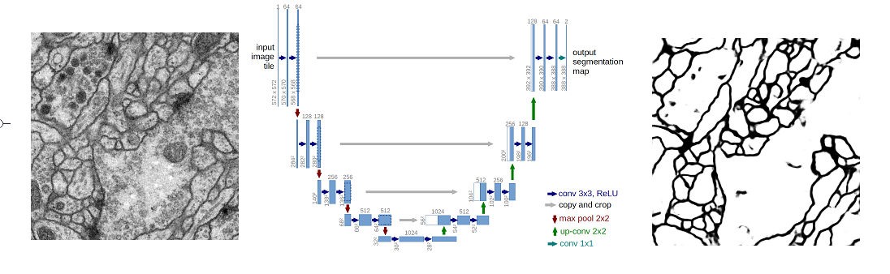
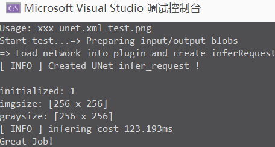

# UNet 网络训练和推理

Train and test Unet in keras, deploy in different  DL framework.

使用 Keras 训练和测试 UNet，并在深度学习推理框架下部署。



## 简介

* 借鉴 UNet 网络原理，搭建 U 形编解码(Encoder-Decoder)语义分割网络，实现细胞分割。

* 使用 Keras 训练好网络后，得到 h5 模型， 并进行推理测试。

* 使用 Keras 和 tensorflow 将 h5 模型转化为 pb 模型，并进行推理测试。

* 使用 OpenVino 2020.R1 对 pb 模型进行优化，得到 IR 中间文件，然后分别利用 OpenVino 的 Python 版 和 C++ 版接口进行推理。

* 使用 pybind11 封装 C++ 版的推理接口，供 Python 调用。

### 关于网络

原始的 UNet 网络结构如图 ：


基于 UNet 网络原理，搭建类似 UNet 的 `U` 形 Encoder-Decoder 编解码网络，实现细胞分割。修改了网络输入大小，基本块的构建及通道个数等。

修改后网络输入和输出都是: `shape=(n, 256, 256, 1), dtype=float32, range in [0.0, 1.1]`；

使用 BCE(binary-cross-entropy) 二值交叉熵作为损失函数进行训练。

### 训练和测试

数据集来自 [isbi challenge](http://brainiac2.mit.edu/isbi_challenge/)。训练图片包含 30 张 512x512x1 的图像，使用 ImageDataGenerator 扩增数据量。

20 个 epochs 后， 网络精度达到 0.96。

网络测试结果如图，(语义)分割结果看上去还可以。


## 使用

### 训练和测试环境

* Python 3.7
* Keras 2.3.1 + Tensorflow 1.14.0 (注意 keras 需要和 tensorflow 匹配)
* OpenVino 2020.R1
* pybind11

### Python 版

进入 py3 目录，分别进行训练(train)、测试(test)、保存 pb(savepb)、测试 pb(testpb)。

Include `train`, `test`, `savepb`, `testpb`.

```bash
cd py3
python demo.py --op train -d 0
python demo.py --op test
python demo.py --op savepb
python demo.py --op testpb
```

### C++ OpenVino 推理

使用 OpenVino 进行推理的基本步骤：

- 首先安装 g++/VS2015+ 和 OpenVino 工具包。
- 将先前训练好的 h5 模型转为 pb 模型，然后使用 mo.py 优化 pb 模型得到 IR 文件(.xml/.bin/.mapping)。
- 创建 C++ 项目，加载 IR 文件，并进行推理。

这里有 VS 项目供参考，使用方法：

- 进入 cpp 文件夹
- 从 [ausk/thirdparty](https://github.com/ausk/thirdparty) 下载依赖的 OpenVino 和 OpenCV 库， 解压 thirdparty 目录到 cpp 目录中。
- 打开 unet.sln 解决方案文件，编译并运行。




## 参考

* [U-Net: Convolutional Networks for Biomedical Image Segmentation](http://lmb.informatik.uni-freiburg.de/people/ronneber/u-net/)
* keras 版 Unet 实现 [zhixuhao/unet](https://github.com/zhixuhao/unet)
* OpenVino 开源版 [opencv/dldt](https://github.com/opencv/dldt)
* 我的知乎文章 [191123 使用 Pybind11 和 OpenCV 创建 Python 库](https://zhuanlan.zhihu.com/p/93299698)
